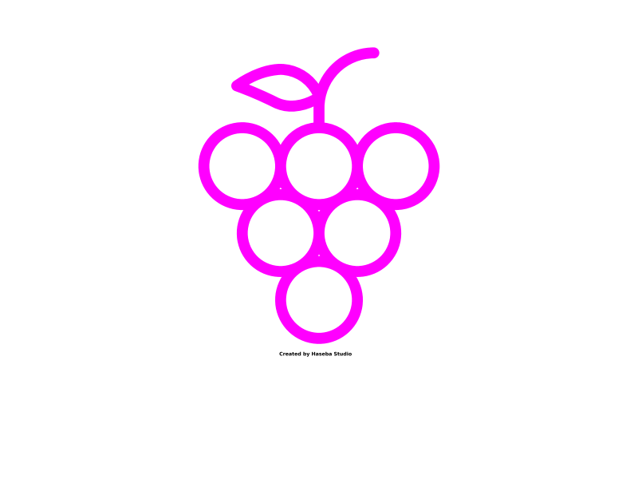

<p align="center">
  
</p>

# GRAPE - Guy's bReast cAncer lymPh nodEs


This repo contains all documentation for the GRAPE dataset hosted on AWS

- Dataset size: 3TB
- Contact name: Gregory Verghese
- Institution name: Kings's College London
- Institution URL: http://cancerbioinformatics.co.uk/
- Download at AWS: https://registry.opendata.aws/guys-breast-cancer-lymph-nodes/
- Contact email: [Gregory Verghese](gregory.e.verghese@kcl.ac.uk)

## Description

This is a retrospective dataset of 1523 H&E-stained whole slide image (WSI) lymph nodes from breast cancer patients. The cohort consisted of 177 patients (122 LN-positive - metastasis was reported in at least 1 LN - and 55 LN-negative patients) with invasive breast carcinoma treated between 1984 and 2002 at Guy’s Hospital London, UK. Slides were scanned and digitised at 40x magnification (0.23 µm/pixel), NanoZoomer H.T2.0 2.0-HT (Hamamatsu Photonics UK, Ltd, Welwyn Garden City, UK).

## Data structure

Patients indexed with KCLCB_pa01 format. Each folder contains WSIs for a single patient.

``` bash
.
└── GRAPE
    ├── KCLCB_pa01
    │   ├── KCLCB_pa01_img1.ndpi
    │   ├── KCLCB_pa01_img2.ndpi
    │   ├── KCLCB_pa01_img3.ndpi
    │   └── KCLCB_pa01_img4.ndpi
    ├── KCLCB_pa02
    │   ├── KCLCB_pa02_img1.ndpi
    │   ├── KCLCB_pa02_img2.ndpi
    │   ├── KCLCB_pa02_img3.ndpi
    ...
```


## Example usage

Below code demonstrates how to load WSIs programmatically using Python Openslide package
 
 ```python
import openslide
import numpy as np
import matplotlib.pyplot as plt

#Read WSI
wsi = openslide.OpenSlide("/Path/to/wsi.ndpi")

#Get slide properties
dims=wsi.dimensions
x_resolution=wsi.properties[openslide.PROPERTY_NAME_MPP_X]
y_resolution=wsi.properties[openslide.PROPERTY_NAME_MPP_X]
base_mag=wsi.properties[openslide.PROPERTY_NAME_OBJECTIVE_POWER]

#Display thumbnail
wsi_thumbnail = wsi.get_thumbnail((1000,1000))
wsi_thumbnail=np.array(wsi_thumbnail)
plt.imshow(wsi_thumbnail)
plt.axis('off')
```


## Credits

If you find the data useful, please cite the below paper:

    @inproceedings{,
        title={},
        booktitle={},
        author={},
        year={}
    }

## License

Shield: [![CC BY-NC-SA 4.0][cc-by-nc-sa-shield]][cc-by-nc-sa]

This work is licensed under a
[Creative Commons Attribution-NonCommercial-ShareAlike 4.0 International License][cc-by-nc-sa].

[![CC BY-NC-SA 4.0][cc-by-nc-sa-image]][cc-by-nc-sa]

[cc-by-nc-sa]: http://creativecommons.org/licenses/by-nc-sa/4.0/
[cc-by-nc-sa-image]: https://licensebuttons.net/l/by-nc-sa/4.0/88x31.png
[cc-by-nc-sa-shield]: https://img.shields.io/badge/License-CC%20BY--NC--SA%204.0-lightgrey.svg


